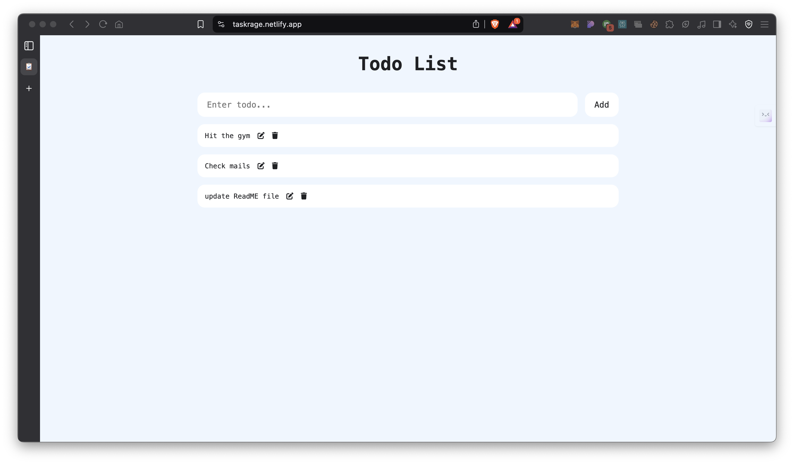
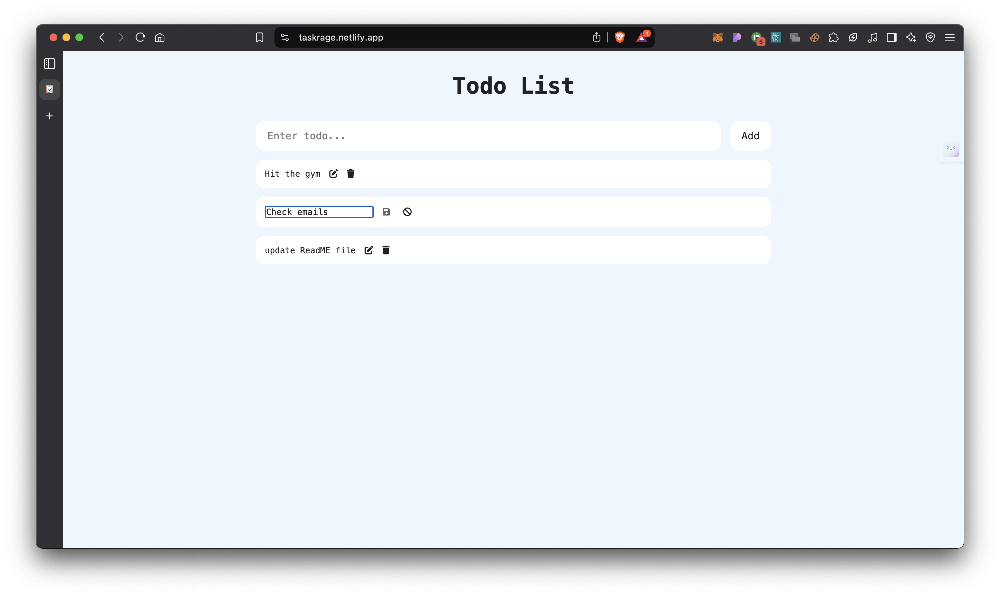

# TaskRage ⚡

## Overview

**TaskRage ⚡** is a no-nonsense, minimalist CRUD todo list built with ReactJS and Vite. Designed for maximum productivity, it helps you manage tasks efficiently without distractions. Add, edit, and delete tasks seamlessly—because getting things done shouldn't be complicated.

## Table of Contents

- [Features](#features)
- [Demo](#demo)
- [Installation](#installation)
- [Technologies Used](#technologies-used)
- [How to Use](#how-to-use)
- [Acknowledgements](#acknowledgements)
- [Project Structure](#project-structure)

## Features

- Simple and intuitive UI
- Full CRUD (Create, Read, Update, Delete) functionality
- Local storage support for task persistence
- Responsive design for all devices
- Fast and lightweight with Vite

## Demo
🔗 **Live Demo:** [TaskRage](https://taskrage.netlify.app/)




## Installation

1. Clone the repository

   ```bash
   git clone https://github.com/thepushkarB/TaskRage.git
   cd TaskRage
   ```

2. Install Dependencies Ensure you have Node.js installed. Then, run:

   ```bash
   npm install
   ```

## Run the Application

```bash
npm run dev
```

The application will be accessible at [http://localhost:5173](http://localhost:5173).

## Technologies Used

- **ReactJS** – JavaScript library for building user interfaces
- **Vite** – Fast frontend build tool
- **Local Storage** – Persistent task saving

## How to Use

1. Add a new task using the input field
2. Edit existing tasks by clicking the edit button
3. Delete tasks when completed or unnecessary
4. Tasks persist using local storage, so your progress stays intact

## Acknowledgements

- [ReactJS](https://react.dev/)
- [Vite](https://vitejs.dev/)
- [Smoljames](https://www.youtube.com/@Smoljames)

## Project Structure

```
TaskRage/
│── src/
│   ├── components/  # Reusable UI components
│   ├── contexts/    # Context API for state management
│   ├── assets/      # Images and icons
│   ├── App.jsx      # Main application logic
│   ├── main.jsx     # Entry point
│── public/          # Static assets
│── index.html       # Main HTML file
│── package.json     # Project dependencies
```

Get things done. No excuses. ⚡
